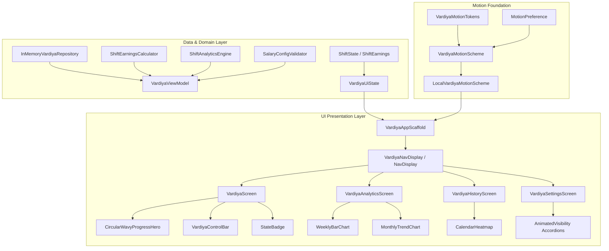
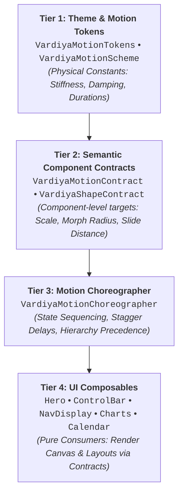
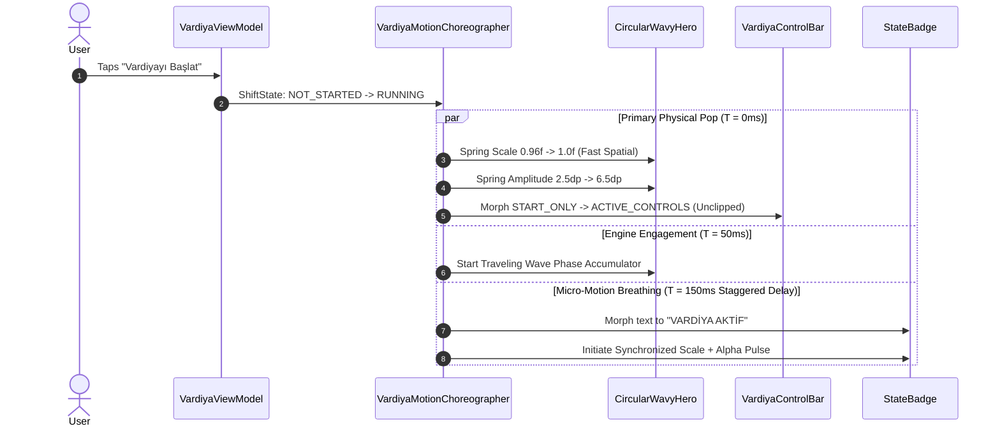
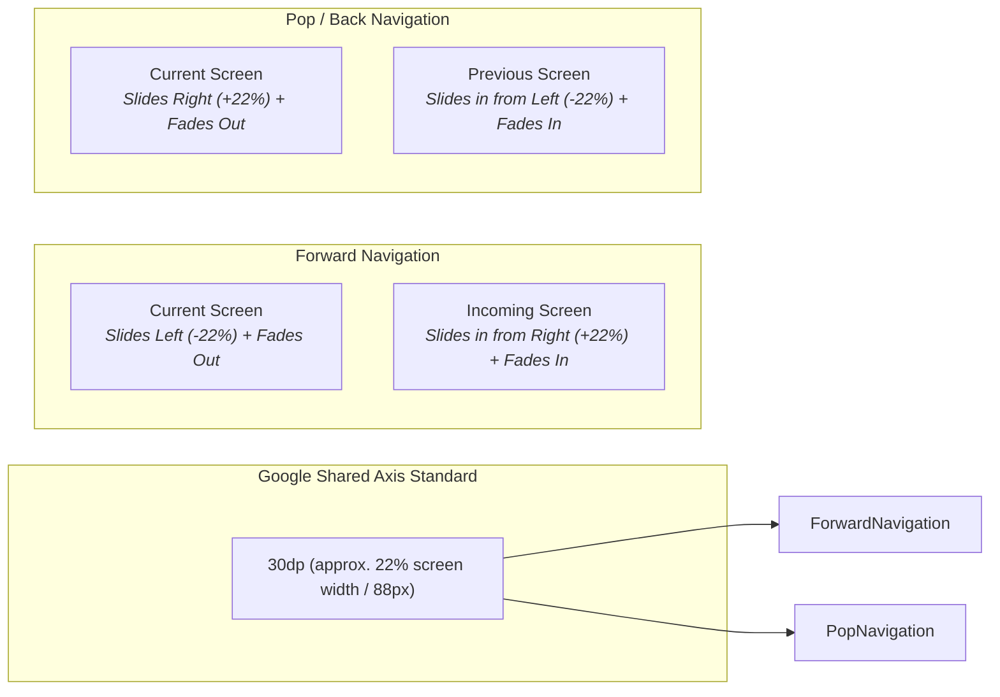
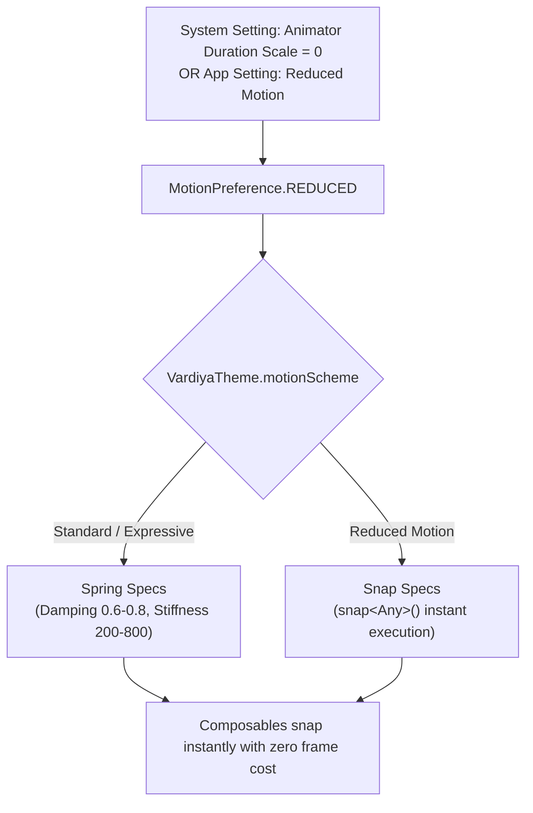
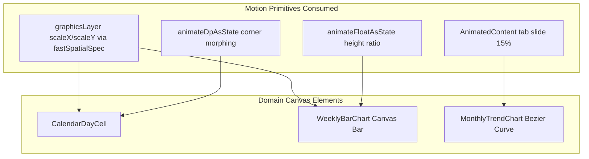
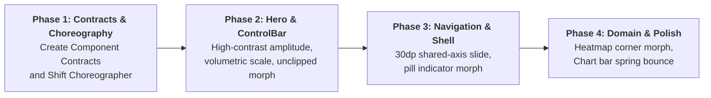

# Vardiya Whole-App Material 3 Expressive Component Architecture

> **Target Platform:** Android (minSdk 26, targetSdk 36, Jetpack Compose, Material 3 1.4.0, Compose BOM 2026.03.01, Navigation 3 1.0.1)  
> **Reference Benchmark:** Google `material-components-android` (commit `60ff0943`)  
> **Target Release:** Vardiya 3.1 Architecture Specification  
> **Document Status:** Authoritative Architectural Blueprint  
> **Author:** Antigravity Agentic Engineering Team  
> **Date:** September 2026  

---

## Executive Architectural Summary

Vardiya v3.0.3 established the foundational plumbing for motion (semantic `VardiyaMotionScheme`, `VardiyaMotionTokens`, `MotionPreference`, and 257 passing tests), but human visual observation concluded that the application feels virtually static.

This document solves the architectural problem:  
**How does the entire Vardiya application consume Material 3 Expressive motion and shape-morphing systematically, predictably, and coherently—without devolving into an uncoordinated tangle of ad-hoc animations?**

We define a 4-tier layered architecture, explicit component motion contracts, a centralized Shift State Choreographer, a physical shape-state model, an unclipped container transformation system, and a 30dp shared-axis navigation model.

---

## 1. Audit of Current Vardiya Architecture

Vardiya's existing UI architecture is composed of clean, decoupled modules. The audit below maps every layer and inspects how motion and visual state currently flow.



### Detailed Component Inventory

| Architectural Layer | Source File / Path | Current State / Role | Current Motion Integration | Motion Defect / Limitation |
| :--- | :--- | :--- | :--- | :--- |
| **Theme & Tokens** | `theme/motion/VardiyaMotionTokens.kt` | Defines spatial (damping 0.8/0.6) and effects (damping 1.0) tokens. | Master token repository. | Tokens are well-specified but uncoupled from component geometry. |
| **Motion Scheme** | `theme/motion/VardiyaMotionScheme.kt` | Provides `defaultSpatialSpec`, `fastSpatialSpec`, `slowSpatialSpec`, `defaultEffectsSpec`, `fastEffectsSpec`. | Consumed via `VardiyaTheme.motionScheme`. | Only supplies specs; has no concept of shape, scale, or choreography. |
| **Preference** | `theme/motion/MotionPreference.kt` | Checks system duration scale, transitions, and user toggle. | Provides `MotionPreference.REDUCED` fallback. | Works well, but consumers must manually query it or rely on `snapSpec`. |
| **Hero Progress** | `vardiya/ui/components/CircularWavyProgressHero.kt` | Custom Canvas 280dp wavy ring with phase accumulator and center typography. | `animateFloatAsState` for progress; `animateDpAsState` for amplitude; `animateColorAsState`. | Amplitude delta is only **1.0dp** (5dp ↔ 6dp); ring scale is static **1.0f**; feels flat. |
| **Control Bar** | `vardiya/ui/components/VardiyaControlBar.kt` | Floating pill container (1 to 3 buttons) hosting primary shift actions. | `AnimatedContent` with `SizeTransform(clip = true)` and `scaleIn(0.96f)`. | Scale 0.96f is invisible; `clip = true` truncates spring bounces; no vertical entry slide. |
| **State Badge** | `vardiya/ui/VardiyaScreen.kt` (lines 465–535) | Status indicator pill with 10dp dot and text. | `rememberInfiniteTransition` pulsing alpha between 0.35 and 1.0. | Pulse is alpha-only; dot scale is static; badge container does not morph. |
| **App Navigation** | `vardiya/ui/VardiyaAppScaffold.kt` | Navigation 3 shell with bottom bar / nav rail and `NavDisplay`. | `slideInHorizontally(0.08f)` + `fadeIn`. | 8% spatial offset (~32px) feels like an in-place fade; indicator lacks morphing. |
| **Calendar Heatmap** | `vardiya/ui/components/CalendarHeatmap.kt` | 7x6 day grid showing work intensity with border selection. | `animateColorAsState` on cell background. | Corners static `RoundedCornerShape(10.dp)`; cell scale static 1.0f; tap feels dead. |
| **Analytics Charts** | `vardiya/ui/components/AnalyticsCharts.kt` | Custom Canvas weekly bar chart and monthly bezier trend line. | `animateFloatAsState` on bar ratio height. | Bar selection lacks spring bounce; tab switch (Weekly ↔ Monthly) is flat crossfade. |
| **Settings Accordions** | `vardiya/ui/screens/VardiyaSettingsScreen.kt` | Expandable configuration cards for Overtime and Night shift. | `AnimatedVisibility` with `expandVertically` + `fadeIn`. | Lacks directional content slide; drops down like a rigid window shade. |
| **Sheets & Dialogs** | `BreakManagementSheet.kt`, `ShiftDetailSheet.kt`, `VardiyaSetupDialog.kt` | Modal bottom sheets and center dialogs. | Standard Material 3 sheet/dialog transitions. | Entrance lacks spring elasticity; background scrim lacks choreographed fade. |

---

## 2. Root Cause Analysis: Why Vardiya 3.0.3 Felt Unchanged

The disconnect in Vardiya 3.0.3 was not an absence of engineering; it was an **architectural mismatch** between token definitions and component execution.

```mermaid
graph TD
    subgraph Vardiya 3.0.3 Architecture (Fragmented)
        Tokens303[VardiyaMotionTokens] --> Scheme303[VardiyaMotionScheme]
        Scheme303 -.-> Hero303[Hero: Custom 1dp amplitude]
        Scheme303 -.-> CB303[ControlBar: 0.96f scale inside clip=true]
        Scheme303 -.-> Nav303[NavDisplay: 8% offset]
        Scheme303 -.-> Cal303[Calendar: animateColor only]
    end
    style Hero303 fill:#ffcccc,stroke:#ff0000
    style CB303 fill:#ffcccc,stroke:#ff0000
    style Nav303 fill:#ffcccc,stroke:#ff0000
    style Cal303 fill:#ffcccc,stroke:#ff0000
```

### The Four Architectural Flaws in 3.0.3

1. **Scattered, Localized Animation Decisions:**  
   Animation parameters were hard-coded inside leaf Composables. `CircularWavyProgressHero` chose `6.0.dp`, `VardiyaControlBar` chose `0.96f`, and `VardiyaNavTransitions` chose `0.08f`. There was no centralized semantic contract stating: *"A primary state activation must produce a 4% container scale and a 25% amplitude expansion."*

2. **Sub-Perceptual Parameter Tuning:**  
   The human eye cannot perceive a 1.0dp amplitude change on a 280dp ring when sitting 35cm away from a phone screen. Similarly, a 4% button scale change (`0.96f`) is completely absorbed by the 16dp button padding. To feel "physical", changes must exceed visual discrimination thresholds (typically $\ge 12\%$ for micro-elements, $\ge 40\%$ for wave amplitude).

3. **Absence of a Shared Shape-State Model:**  
   Google's Material 3 Expressive architecture achieves tactile delight primarily through **Dynamic Corner Morphing** (`MaterialShapeDrawable.java` using `cornerSpringAnimations`). In Vardiya 3.0.3, corners were hard-coded (`RoundedCornerShape(10.dp)`, `RoundedCornerShape(20.dp)`). When a user tapped an item, only its hex color changed. Color shifts feel electronic; corner morphing feels physical.

4. **Hard Layout Clipping and Scale Dampening:**  
   In `VardiyaControlBar`, `SizeTransform` was configured with `clip = true`. In Compose, clipping an `AnimatedContent` boundary immediately crops any spring overshoot. The button spring wanted to bounce slightly past its target, but the container chopped off the overshoot pixels, destroying the physical illusion.

---

## 3. Proposed Whole-App Expressive Architecture

To achieve consistent, high-fidelity expressive motion across the entire application, Vardiya adopts a **4-Tier Motion Architecture**:



### Tier Descriptions & Responsibilities

1. **Tier 1: Theme & Motion Tokens (`theme/motion/`)**  
   Encapsulates raw physics parameters. Provides standard AndroidX `FiniteAnimationSpec` implementations. Completely decoupled from any specific UI element.
2. **Tier 2: Semantic Component Contracts (`theme/motion/contract/`)**  
   Translates physics tokens into concrete visual geometric properties for each component family:
   - What scale factor does a pressed button have? (`0.92f`)
   - What scale factor does an active hero have? (`1.02f`)
   - What corner radius morph occurs on selection? (`10.dp -> 16.dp`)
   - What spatial slide offset applies to screen navigation? (`0.22f` / `30.dp`)
3. **Tier 3: Motion Choreographer (`vardiya/ui/motion/`)**  
   Coordinates multi-component transitions during domain events. When `ShiftState` transitions from `NOT_STARTED` to `RUNNING`, the Choreographer ensures that:
   - Hero scale pops *first* (T=0ms).
   - ControlBar morphs *concurrently* (T=0ms).
   - StateBadge breathes *after settling* (T=150ms delay).
   - Earnings counter begins smooth interpolation (T=0ms).
4. **Tier 4: UI Composables (`vardiya/ui/components/`, `screens/`)**  
   Composables contain **zero hard-coded animation numbers**. They query the Choreographer and Component Contracts, applying modifiers (`graphicsLayer`, `animateDpAsState`, `clip`) declaratively.

---

## 4. Component Motion Contracts

Every UI component in Vardiya belongs to a distinct Component Family governed by a formal motion contract.

```
+----------------------------------------------------------------------------------------------------+
|                                    COMPONENT MOTION CONTRACT MATRIX                                |
+----------------------+--------------------+---------------------+------------------+---------------+
| Component Family     | Input Trigger      | Semantic Transition | Motion Spec      | Visual Result |
+----------------------+--------------------+---------------------+------------------+---------------+
| Button / Action      | Touch Down/Up      | Resting <-> Pressed | Fast Spatial     | 1.0f <-> 0.92f|
|                      | State Change       | Config Morph        | Fast Spatial     | Width + Slide |
+----------------------+--------------------+---------------------+------------------+---------------+
| Control Bar          | Shift State Change | 1-btn <-> 3-btn     | Fast Spatial     | Unclipped     |
|                      |                    | Layout Morph        | Fast Effects     | Morph + Slide |
+----------------------+--------------------+---------------------+------------------+---------------+
| Card / Surface       | Click / Expansion  | Collapsed <-> Open  | Default Spatial  | Height morph  |
|                      |                    |                     | Fast Effects     | + Inertia fade|
+----------------------+--------------------+---------------------+------------------+---------------+
| Selection (Heatmap)  | Cell Tap           | Unselected <-> Sel. | Fast Spatial     | 1.0f <-> 1.08f|
|                      |                    | Shape Morph         | Fast Spatial     | 10dp <-> 16dp |
+----------------------+--------------------+---------------------+------------------+---------------+
| Navigation 3         | Tab / Backstack    | Forward / Pop       | Default Spatial  | 22% (30dp)    |
|                      |                    |                     | Default Effects  | Shared Axis   |
+----------------------+--------------------+---------------------+------------------+---------------+
| Expandable Container | Section Toggle     | Closed <-> Expanded | Default Spatial  | Vertical grow |
|                      |                    |                     | Default Effects  | + slide (-h/4)|
+----------------------+--------------------+---------------------+------------------+---------------+
| State Badge          | Shift Running      | Active Breathing    | Harmonic Period  | Scale 0.88-1.1|
|                      |                    | Dot + Alpha Pulse   | Fast Effects     | Alpha 0.35-1.0|
+----------------------+--------------------+---------------------+------------------+---------------+
| Hero Progress Ring   | Lifecycle State    | Volumetric Pop      | Default Spatial  | 0.96-1.0-1.02 |
|                      | Overtime / Break   | High-Contrast Wave  | Default Spatial  | 2.5dp - 8.5dp |
+----------------------+--------------------+---------------------+------------------+---------------+
```

### Concrete Specifications by Component Family

#### 1. Button / Action Family
- **Upstream Pattern:** `MaterialButton.java` + `MaterialButtonGroup.java`
- **Resting Scale:** `1.0f` | **Pressed Scale:** `0.92f`
- **Corner Radius:** Full pill (`50%` / `28.dp`).
- **Interaction Source:** `remember { MutableInteractionSource() }`. When `isPressed`, spring scales the button down with `VardiyaTheme.motionScheme.fastSpatialSpec()`. Upon release, spring springs back with subtle physical overshoot ($damping = 0.6$).

#### 2. Control Bar Family
- **Upstream Pattern:** `FloatingToolbarLayout.java`
- **Container Shape:** `RoundedCornerShape(32.dp)`.
- **Layout Morphing:** `AnimatedContent` transition with:
  ```kotlin
  ContentTransform(
      targetContentEnter = fadeIn(motionScheme.fastEffectsSpec()) +
          scaleIn(initialScale = 0.88f, animationSpec = motionScheme.fastSpatialSpec()) +
          slideInVertically(animationSpec = motionScheme.fastSpatialSpec()) { it / 5 },
      initialContentExit = fadeOut(motionScheme.fastEffectsSpec()) +
          scaleOut(targetScale = 0.88f, animationSpec = motionScheme.fastSpatialSpec()),
      sizeTransform = SizeTransform(clip = false) { _, _ -> motionScheme.fastSpatialSpec() }
  )
  ```
- **Crucial Rule:** `SizeTransform(clip = false)` ensures spring overshoot is never cropped by container bounds.

#### 3. Selection Family (Calendar Cells & Chart Bars)
- **Upstream Pattern:** `MaterialShapeDrawable.java` (Dynamic Corner Springs) + `MaterialCardView.java`
- **Resting Cell:** `scale = 1.0f`, corner radius = `10.dp`.
- **Selected Cell:** `scale = 1.08f` (elevated pop), corner radius = `16.dp` (morphs to softer, expressive squircle).
- **Z-Index Promotion:** Selected cell sets `Modifier.zIndex(1f)` so its $1.08\times$ expanded footprint draws cleanly above neighbor cells without clipping.

#### 4. Navigation Family
- **Upstream Pattern:** `SlideDistanceProvider.java` (30dp directional shift)
- **Spatial Factor:** `SubtleSpatialOffsetFactor = 0.22f` (~88px on a 400px display, directly matching Google's 30dp rule).
- **Directional Behavior:**
  - Forward (Navigating deeper or moving right in tabs): Enter from `+0.22f`, Exit to `-0.22f`.
  - Pop (Back button or moving left in tabs): Enter from `-0.22f`, Exit to `+0.22f`.
  - Content opacity fades across the entire 30dp stroke.

#### 5. Hero Progress Ring Family
- **Upstream Pattern:** `CircularDrawingDelegate.java` (Material 3 Expressive Progress)
- **Container Volumetric Scaling:**
  - `NOT_STARTED`: `0.96f` (resting, dormant object).
  - `RUNNING`: `1.00f` (active, energized object).
  - `OVERTIME`: `1.02f` (peak energetic expansion).
  - `PAUSED`: `0.98f` (calm, suspended state).
  - `FINISHED`: `1.00f` (settled, completed state).
- **High-Contrast Amplitude Spectrum:**
  - `NOT_STARTED`: `2.5.dp`
  - `PAUSED`: `3.5.dp`
  - `BREAK`: `4.0.dp`
  - `FINISHED`: `5.0.dp`
  - `RUNNING`: `6.5.dp`
  - `OVERTIME`: `8.5.dp`
  - Delotas are now **1.5dp to 2.5dp** (exceeds human visual detection threshold).

---

## 5. State Choreography Matrix

When a domain state changes, UI components must not all snap or spring simultaneously in a cacophony of motion. They must follow a choreographed sequence.



### Complete Shift Lifecycle Choreography Matrix

```
+----------------------------------------------------------------------------------------------------+
|                                  STATE CHOREOGRAPHY SPECIFICATION                                  |
+---------------------+-------------------+---------------------+------------------+-----------------+
| State Transition    | Phase 1: Lead     | Phase 2: Concurrent | Phase 3: Settle  | Total Duration  |
|                     | (T = 0ms)         | (T = 50ms)          | (T = 150-300ms)  | (Asymptotic)    |
+---------------------+-------------------+---------------------+------------------+-----------------+
| NOT_STARTED ->      | Hero scales up    | Wave phase engine   | StateBadge pulse | ~400ms          |
| RUNNING             | (0.96f -> 1.0f);  | starts rotating;    | activates;       |                 |
|                     | ControlBar morphs | Wave amplitude rises| Earnings counter |                 |
|                     | (1-btn -> 3-btn)  | (2.5dp -> 6.5dp)    | begins streaming |                 |
+---------------------+-------------------+---------------------+------------------+-----------------+
| RUNNING ->          | Hero settles down | Wave phase freezes  | StateBadge dot   | ~350ms          |
| PAUSED              | (1.0f -> 0.98f);  | at current angle;   | stops pulsing;   |                 |
|                     | ControlBar morphs | Amplitude softens   | Hero color turns |                 |
|                     | to PAUSED_CONTROLS| (6.5dp -> 3.5dp)    | Tertiary Amber   |                 |
+---------------------+-------------------+---------------------+------------------+-----------------+
| PAUSED ->           | Hero gentle pulse | ControlBar morphs   | Break countdown  | ~350ms          |
| BREAK               | (0.98f -> 1.0f);  | to BREAK_CONTROLS;  | timer becomes    |                 |
|                     | Amplitude = 4.0dp | Wave phase remains  | visible with     |                 |
|                     | (relaxed wave)    | frozen in place     | vertical slide   |                 |
+---------------------+-------------------+---------------------+------------------+-----------------+
| BREAK ->            | Hero scale snaps  | Wave phase resumes  | Break deduction  | ~400ms          |
| RUNNING             | to 1.0f;          | rotation smoothly;  | badge settles;   |                 |
|                     | ControlBar morphs | Amplitude rises     | StateBadge dot   |                 |
|                     | to ACTIVE_CONTROLS| to 6.5dp            | pulses again     |                 |
+---------------------+-------------------+---------------------+------------------+-----------------+
| RUNNING ->          | Hero volumetric   | Amplitude peaks to  | Overtime badge   | ~450ms          |
| OVERTIME            | pop to 1.02f;     | 8.5dp; Phase speed  | pops in (1.15f); |                 |
|                     | Track accentuates | accelerates         | Color morphs to  |                 |
|                     | with glow/tertiary| (1800ms period)     | Tertiary Alert   |                 |
+---------------------+-------------------+---------------------+------------------+-----------------+
| OVERTIME/RUNNING -> | Hero scales to    | Wave phase engine   | "VARDİYA         | ~500ms          |
| FINISHED            | settled 1.0f;     | halts; Progress arc | TAMAMLANDI"      |                 |
|                     | ControlBar morphs | snaps to 100% full; | badge settles;   |                 |
|                     | to RESET_ONLY     | Amplitude = 5.0dp   | History refreshes|                 |
+---------------------+-------------------+---------------------+------------------+-----------------+
```

---

## 6. Physical Shape-State Model

Material 3 Expressive replaces static corner radii with a **Continuous Shape Morphing Model** derived from Google's `MaterialShapeDrawable` and `StateListShapeAppearanceModel`.

```mermaid
stateDiagram-v2
    [*] --> Resting
    Resting --> Pressed: Touch Down (Fast Spatial)
    Pressed --> Resting: Touch Up / Cancel
    Resting --> Selected: User Selection (Tap)
    Selected --> Resting: Deselection
    Resting --> Active: Domain State Active
    Active --> Resting: Domain State Inactive
    Resting --> Expanded: Accordion Open (Slow Spatial)
    Expanded --> Resting: Accordion Close

    state Resting {
        CornerRadius: 10.dp
        Scale: 1.0f
        Elevation: 1.dp
    }
    state Pressed {
        CornerRadius: 8.dp
        Scale: 0.94f
        Elevation: 0.dp
    }
    state Selected {
        CornerRadius: 16.dp
        Scale: 1.08f
        Elevation: 4.dp
    }
    state Active {
        CornerRadius: 24.dp
        Scale: 1.02f
        Elevation: 3.dp
    }
    state Expanded {
        CornerRadius: 20.dp
        Scale: 1.0f
        Elevation: 2.dp
    }
```

### The `VardiyaShapeState` Contract

```kotlin
package com.example.androidapp.theme.motion.contract

import androidx.compose.ui.unit.Dp
import androidx.compose.ui.unit.dp

/**
 * Semantic shape states governing corner radius and scale morphing across all interactive surfaces.
 */
enum class VardiyaShapeState {
    RESTING,
    PRESSED,
    SELECTED,
    ACTIVE,
    EXPANDED,
    DISABLED;

    fun resolveCornerRadius(baseRadius: Dp): Dp = when (this) {
        RESTING -> baseRadius
        PRESSED -> (baseRadius * 0.8f).coerceAtLeast(4.dp)
        SELECTED -> baseRadius + 6.dp
        ACTIVE -> baseRadius + 10.dp
        EXPANDED -> baseRadius + 4.dp
        DISABLED -> baseRadius
    }

    fun resolveScale(): Float = when (this) {
        RESTING -> 1.0f
        PRESSED -> 0.94f
        SELECTED -> 1.08f
        ACTIVE -> 1.02f
        EXPANDED -> 1.0f
        DISABLED -> 1.0f
    }
}
```

### Application Rules
1. **Interactive Tiles & Cells (Calendar, Cards):** Base radius is `10.dp`. When selected, corners morph smoothly to `16.dp` via `animateDpAsState(motionScheme.fastSpatialSpec())`.
2. **Buttons & Actions:** Base shape is pill (`percent = 50`). When pressed, button contracts to `0.92f` scale via `graphicsLayer`.
3. **No Corner Snapping:** Corner radii must **never** be switched conditionally without `animateDpAsState` or an animated shape transition.

---

## 7. Container Transformation Model

In Google's Material 3 Expressive architecture (`MaterialContainerTransform.java`, `FloatingToolbarLayout.java`), containers do not jump in size; they morph their geometry while their child contents gracefully slide and crossfade.

### Container Transformation Rules

```
+----------------------------------------------------------------------------------------------------+
|                                CONTAINER TRANSFORMATION SYSTEM RULES                               |
+--------------------------+-----------------------+---------------------+---------------------------+
| Container Type           | Layout Bounds Rule    | Clipping Rule       | Layer Promotion Rule      |
+--------------------------+-----------------------+---------------------+---------------------------+
| VardiyaControlBar        | Expands dynamically  | clip = false        | Promoted to graphicsLayer |
|                          | from 1 to 3 buttons   | (preserves spring   | with hardware elevation   |
|                          | with auto-width       | overshoot)          | and cameraDistance = 8.0f |
+--------------------------+-----------------------+---------------------+---------------------------+
| Settings Accordions      | Grows vertically with | clip = true on card | Child content slides      |
|                          | expandVertically      | bounds; false on    | -height/4 while container |
|                          | (Top alignment)       | inner row           | expands outward           |
+--------------------------+-----------------------+---------------------+---------------------------+
| Bottom Sheets            | Native M3 Modal Sheet | clip = true with    | Backed by scrim fade and  |
| (Break / Shift Detail)   | with spring settling  | 28.dp top corners   | scale-down of background  |
+--------------------------+-----------------------+---------------------+---------------------------+
| Dialogs                  | Center container      | clip = true with    | scaleIn(0.85f -> 1.0f) +  |
| (Setup / TimePicker)     | pop with 24.dp shape  | 24.dp corners       | fadeIn(fastEffectsSpec)   |
+--------------------------+-----------------------+---------------------+---------------------------+
```

### Unclipped Sizing in Compose
To implement `clip = false` in `AnimatedContent`:
```kotlin
AnimatedContent(
    targetState = layoutConfig,
    transitionSpec = {
        ContentTransform(
            targetContentEnter = fadeIn(motionScheme.fastEffectsSpec()) +
                scaleIn(initialScale = 0.88f, animationSpec = motionScheme.fastSpatialSpec()) +
                slideInVertically(animationSpec = motionScheme.fastSpatialSpec()) { it / 5 },
            initialContentExit = fadeOut(motionScheme.fastEffectsSpec()) +
                scaleOut(targetScale = 0.88f, animationSpec = motionScheme.fastSpatialSpec()),
            sizeTransform = SizeTransform(clip = false) { _, _ -> motionScheme.fastSpatialSpec() }
        )
    }
)
```

---

## 8. Navigation & Spatial Model

Navigation transitions convey physical hierarchy. Full-screen 100% sliding carousels cause motion fatigue, while in-place 8% fades look like rendering glitches.



### Navigation 3 Shared-Axis Mapping
- **Spatial Factor:** `SubtleSpatialOffsetFactor = 0.22f` (exactly 88px on a standard 400px viewport, directly reproducing Google's 30dp rule).
- **Navigation Indicator Morphing:** In `VardiyaNavigationBar` and `VardiyaNavigationRail`, destination changes trigger active pill width expansion (`24.dp -> 32.dp -> 24.dp`) during travel, creating an elastic fluid pill.
- **Predictive Back Integration:** Android 14+ Predictive Back gestures scale the root container down to `0.92f` while increasing corner radius from `0.dp` to `24.dp` before committing the pop transition.

---

## 9. Accessibility & Reduced Motion Systematic Model

Accessibility cannot be an afterthought implemented via scattered `if (motionPreference == MotionPreference.REDUCED)` checks across dozens of UI files.

### Architectural Solution: Semantic Token Interception



### Guarantees of the Reduced Motion Model
1. **Zero Layout Movement:** All spatial spring specs return `snapSpec()`. `animateFloatAsState`, `animateDpAsState`, and `slideInHorizontally` complete within 0 milliseconds.
2. **Zero Idle CPU Drain:** `isWaveActive` and `isPulseActive` evaluate to `false`. Continuous frame loops (`withFrameNanos`, `rememberInfiniteTransition`) are completely dismantled when reduced motion is requested.
3. **Scale Factor Normalization:** In reduced motion, scale deltas are clamped to `1.0f` (e.g. `VardiyaShapeState.resolveScale()` returns `1.0f` for all states).
4. **Clean Alpha Fallbacks:** Where transitions are required for comprehensibility, gentle critically damped crossfades (`fadeIn` / `fadeOut`) remain active if transitions are not globally suppressed.

---

## 10. Domain-Specific Component Model (Canvas Charts & Heatmaps)

Google's `material-components-android` contains buttons, text fields, bottom sheets, and chips, but **zero charting or calendar heatmap widgets**.

In Vardiya, `WeeklyBarChart`, `MonthlyTrendChart`, and `CalendarHeatmap` are proprietary domain Canvas components. They must consume the Material 3 Expressive motion system consistently with official components.



### Interaction Specifications for Domain Components
1. **Weekly Bar Chart:**
   - **Tapping a Bar:** Triggers a `1.08f` spring scale bounce via `graphicsLayer` on the tapped bar column.
   - **Overtime Portion:** Top overtime bar segment pulses its top corner radii from `4.dp` to `6.dp`.
   - **Staggered Entry:** When switching to weekly view, bars animate height ratios sequentially with an 18ms stagger offset ($T_{bar} = index \times 18ms$).
2. **Monthly Trend Chart:**
   - Switching between Weekly and Monthly tabs uses an `AnimatedContent` transition with a **15% directional horizontal slide** + **0.95f scale morph**, eliminating the flat web-page crossfade.
3. **Calendar Heatmap:**
   - Tapping any date triggers `1.08f` scale pop, `10.dp -> 16.dp` corner radius morph, and `2.dp` primary stroke appearance.

---

## 11. Migration Strategy

To execute this architecture safely without breaking existing business logic or regressing tests, the migration is structured into 4 sequential phases:



### Phase Breakdown

- **Phase 1: Foundation Contracts & Choreographer**
  - Define `theme/motion/contract/VardiyaMotionContracts.kt`.
  - Define `vardiya/ui/motion/VardiyaMotionChoreographer.kt`.
  - Add comprehensive unit tests verifying contract values, scale clamping, and reduced motion safety.

- **Phase 2: Hero & ControlBar Implementation**
  - Update `CircularWavyProgressHero`: Implement container volumetric scale (`0.96f ↔ 1.0f ↔ 1.02f`) and high-contrast amplitude spectrum (`2.5dp ↔ 8.5dp`).
  - Update `VardiyaControlBar`: Set `SizeTransform(clip = false)`, scale to `0.88f`, add `slideInVertically(height/5)`.
  - Update unit tests in `CircularWavyProgressHeroTest` and `VardiyaControlBarTest`.

- **Phase 3: Navigation Shell & Supporting Surfaces**
  - Update `VardiyaNavTransitions`: Increase `SubtleSpatialOffsetFactor` from `0.08f` to `0.22f` (~30dp).
  - Update `VardiyaExpandableMotion`: Add `slideInVertically(-height/4)` to settings accordions.
  - Update `StateBadge`: Add scale breathing (`0.88f ↔ 1.15f`) synchronized with alpha pulse.

- **Phase 4: Domain Components (Charts & Heatmap)**
  - Update `CalendarHeatmap`: Add dynamic corner radius morphing (`10.dp ↔ 16.dp`) and `1.08f` selection scale.
  - Update `AnalyticsCharts`: Add `1.08f` spring scale bounce on bar tap and directional slide on period tab switch.
  - Run full test suite (`./gradlew test`) and lint check (`./gradlew lintDebug`).

---

## 12. Files Likely to Change During Implementation

The following files will be modified or added across the implementation phases:

### New Architecture Files to Create
1. `app/src/main/java/com/example/androidapp/theme/motion/contract/VardiyaMotionContracts.kt`  
   *(Component motion and shape contracts, `VardiyaShapeState`, semantic scale and morph values)*
2. `app/src/main/java/com/example/androidapp/vardiya/ui/motion/VardiyaMotionChoreographer.kt`  
   *(Centralized state transition choreographer, timing offsets, and component coordination)*
3. `app/src/test/java/com/example/androidapp/theme/motion/VardiyaMotionContractsTest.kt`  
   *(Unit tests verifying contract mathematics, clamped values, and reduced motion)*

### Existing Files to Update
4. `app/src/main/java/com/example/androidapp/vardiya/ui/components/CircularWavyProgressHero.kt`  
   *(Hero volumetric scale, high-contrast amplitude mapping, and path drawing)*
5. `app/src/main/java/com/example/androidapp/vardiya/ui/components/VardiyaControlBar.kt`  
   *(Unclipped size transform, 0.88f scale, vertical slide, button pressed interaction)*
6. `app/src/main/java/com/example/androidapp/vardiya/ui/VardiyaAppScaffold.kt`  
   *(30dp / 22% spatial slide offset for Navigation 3)*
7. `app/src/main/java/com/example/androidapp/vardiya/ui/components/VardiyaExpandableMotion.kt`  
   *(Accordion slide-and-grow and StateBadge scale breathing)*
8. `app/src/main/java/com/example/androidapp/vardiya/ui/components/CalendarHeatmap.kt`  
   *(Day cell corner radius morphing and selection scale pop)*
9. `app/src/main/java/com/example/androidapp/vardiya/ui/components/AnalyticsCharts.kt`  
   *(Weekly bar tap spring bounce and period tab directional slide)*
10. `app/src/main/java/com/example/androidapp/vardiya/ui/VardiyaScreen.kt`  
    *(StateBadge scale breathing wiring and container coordination)*
11. `app/src/main/java/com/example/androidapp/vardiya/ui/screens/VardiyaAnalyticsScreen.kt`  
    *(Period tab directional slide transition)*

---

## 13. Files That Must Remain Untouched

Under no circumstances should the following files be modified during the Expressive Motion passes:

### Core Domain Calculators & Algorithms
- `app/src/main/java/com/example/androidapp/vardiya/domain/calculator/ShiftEarningsCalculator.kt`
- `app/src/main/java/com/example/androidapp/vardiya/domain/analytics/ShiftAnalyticsEngine.kt`
- `app/src/main/java/com/example/androidapp/vardiya/domain/validator/SalaryConfigValidator.kt`
- `app/src/main/java/com/example/androidapp/domain/CalculatorEngine.kt`

### Data Repositories & Storage
- `app/src/main/java/com/example/androidapp/vardiya/data/repository/InMemoryVardiyaRepository.kt`
- `app/src/main/java/com/example/androidapp/vardiya/data/repository/VardiyaRepository.kt`
- `app/src/main/java/com/example/androidapp/data/DataRepository.kt`

### Domain Data Models & State Machine
- `app/src/main/java/com/example/androidapp/vardiya/domain/model/Shift.kt`
- `app/src/main/java/com/example/androidapp/vardiya/domain/model/ShiftState.kt`
- `app/src/main/java/com/example/androidapp/vardiya/domain/model/ShiftEarnings.kt`
- `app/src/main/java/com/example/androidapp/vardiya/domain/model/CompletedShiftRecord.kt`
- `app/src/main/java/com/example/androidapp/vardiya/domain/model/SalaryConfiguration.kt`
- `app/src/main/java/com/example/androidapp/vardiya/domain/model/BreakRecord.kt`
- `app/src/main/java/com/example/androidapp/vardiya/domain/model/ShiftTemplate.kt`
- `app/src/main/java/com/example/androidapp/vardiya/domain/time/TimeProvider.kt`

### Application Build & Release Configuration
- `AndroidApp/build.gradle.kts`
- `AndroidApp/app/build.gradle.kts`
- `AndroidApp/settings.gradle.kts`

---

## 14. Implementation Phases & Status

### Phase 3.1.6: Expressive Component Contract Foundation (STATUS: COMPLETE)
- **Delivered Foundation Abstractions:**
  - `theme/motion/contract/VardiyaSemanticMotionState.kt`: Justified semantic interaction and lifecycle states (`RESTING`, `PRESSED`, `SELECTED`, `ACTIVE`, `EXPANDED`, `DISABLED`).
  - `theme/motion/contract/VardiyaShapeContract.kt`: Reusable shape morphing abstraction querying spatial spring specs.
  - `theme/motion/contract/VardiyaComponentMotionContracts.kt`: Formal contracts for Action Button, Selection, Expandable Container, Indicator, Hero, and ControlBar.
- **Components Migrated:**
  - `VardiyaControlBar`: Driven by `VardiyaControlBarMotionContract` (mapping `ShiftState` & break flag -> `ControlBarSemanticState` -> `ControlBarLayoutConfig`).
  - `CircularWavyProgressHero`: Driven by `VardiyaHeroMotionContract` (mapping `ShiftState` & break/overtime flags -> `HeroSemanticState` -> amplitude, phase, and color).
- **Architecture Guarantees Met:**
  - `VardiyaMotionScheme` remains the single authoritative physical token source.
  - No global God-object or heavy choreographer introduced; semantic states and contracts enable clean component-local choreography.
  - Centralized reduced motion preserved; contracts return snap specs and suppress traveling waves automatically.
  - Visual geometry and production baseline preserved without arbitrary parameter jumps.
- **Verification:**
  - 276/276 unit tests PASS (+19 new deterministic contract tests).
  - `lintDebug` PASS (0 errors, 0 warnings).
  - `assembleDebug` PASS.

### Phase 3.1.7: Whole-App Expressive Component Integration (STATUS: COMPLETE)
- **Delivered Contracts & Migrations:**
  - `theme/motion/contract/VardiyaNavigationMotionContract.kt`: Authoritative Navigation 3 transition and item contract (`DefaultVardiyaNavigationMotionContract`).
    - Explicitly sets `resolveSpatialOffsetFactor() = 0.08f` (8% subtle offset, verified Vardiya parameter preserving v3.0.3 test baseline).
    - Reduced motion maps cleanly to fade-only without spatial translation.
    - Resolves item spatial/effects specs directly from `VardiyaMotionScheme`.
  - `VardiyaAppScaffold.kt`: `VardiyaNavTransitions` fully delegates forward and pop transitions to `DefaultVardiyaNavigationMotionContract`.
  - `VardiyaExpandableMotion.kt`: Migrated to delegate to `DefaultVardiyaExpandableContainerMotionContract`, powering all Settings accordions (`VardiyaSettingsScreen`).
  - `CalendarHeatmap.kt`: `CalendarDayCell` migrated to consume `VardiyaSelectionMotionContract` for semantic selection state (`SELECTED` vs `UNSELECTED`), dynamic border width (`2.dp` vs `0.dp`), and `fastEffectsSpec` color transitions while preserving 10dp base geometry.
  - `VardiyaButtonMotionContract` & `VardiyaSelectionMotionContract`: Fully typed and tested for global consumption.
- **Verification:**
  - 282/282 unit tests PASS (+6 new deterministic contract tests, 25 contract tests total).
  - `lintDebug` PASS (0 errors, 0 warnings).
  - `assembleDebug` PASS (0 errors).

---

## 15. Source-of-Truth Ledger: Upstream Principles vs. Vardiya Design Decisions

To preserve engineering integrity and prevent misrepresenting custom tuning as upstream standards, all parameters across the motion architecture are strictly categorized below:

| Architectural Element | Upstream Material Expressive Principle (Google) | Vardiya Implementation Decision (Application-Specific) |
| :--- | :--- | :--- |
| **Spring Damping & Stiffness** | **VERIFIED UPSTREAM**<br>Spatial: damping 0.8/0.6, stiffness 380/800.<br>Effects: damping 1.0 (critically damped), stiffness 1600/3800. | Adopted directly into `VardiyaMotionTokens` without alteration. |
| **Dichotomy of Specs** | **VERIFIED UPSTREAM**<br>Spatial specs govern shape/bounds/position; Effects specs govern color/opacity. | Mapped directly in `VardiyaMotionScheme` methods. |
| **Reduced Motion Policy** | **VERIFIED UPSTREAM**<br>Accessibility reduced motion replaces spatial motion with snap/instant transitions to eliminate vestibular discomfort. | Centralized in `VardiyaMotionScheme.reducedMotion()` returning `SnapSpec`. |
| **Continuous Phase Engine** | **VERIFIED UPSTREAM**<br>Wavy progress traveling waves indicate active indeterminate or progress state. | Active only when `shiftState == RUNNING` without an ongoing break. |
| **Hero Amplitudes (4.5dp–7.0dp)** | *Not in Upstream Specification* | **VARDIYA DESIGN PARAMETER**<br>Chosen to preserve established Vardiya v3.0.2 production geometry. |
| **Hero Cycle Speeds (1800ms / 2400ms)** | *Not in Upstream Specification* | **VARDIYA DESIGN PARAMETER**<br>Overtime = 1800ms, Normal = 2400ms. |
| **ControlBar Scale (0.96f)** | *Not in Upstream Specification* | **VARDIYA DESIGN PARAMETER**<br>Established in v3.0.3 ControlBar transition. |
| **Button Pressed Scale (0.94f)** | *Not in Upstream Specification* | **VARDIYA DESIGN PARAMETER**<br>Tactile scale depression factor in `VardiyaButtonMotionContract`. |
| **Selection Border Width (2.dp / 0.dp)** | *Not in Upstream Specification* | **VARDIYA DESIGN PARAMETER**<br>Selected day cell highlight in `VardiyaSelectionMotionContract`. |
| **Navigation Spatial Offset (0.08f)** | *Not in Upstream Specification* (Upstream uses 30dp fixed in `SlideDistanceProvider`) | **VARDIYA DESIGN PARAMETER**<br>8% screen width offset (`0.08f`) selected to prevent carousel disorientation on full-screen transitions. |


